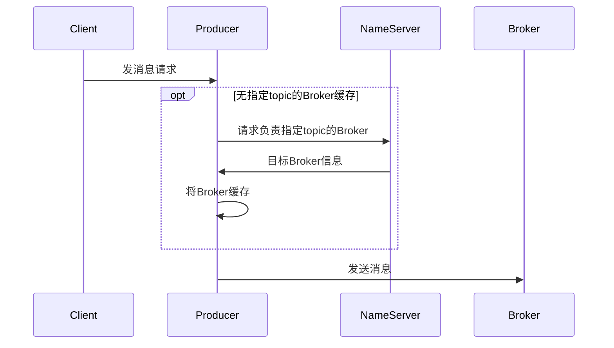
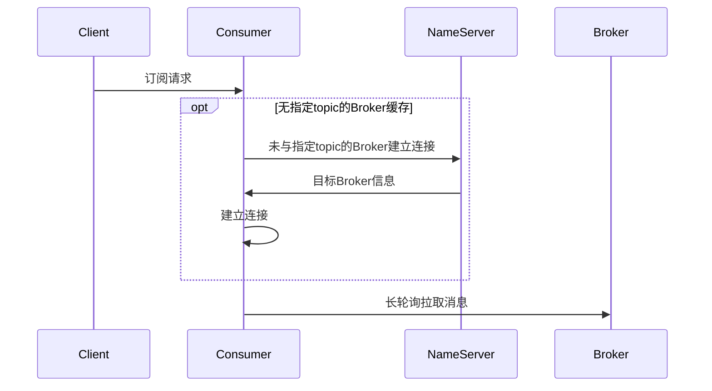

## 分布式系统第2次实验报告

| 姓名   | 学号     |
| ------ | -------- |
| 常程   | 19231149 |
| 李宇轩 | 19231151 |

### 技术方案&原理解析

#### 消息中间件

使用消息队列这一外部中间件来实现系统的功能拆分，实现业务的松耦合。

#### RocketMQ的基本概念

##### NameServer

一个无状态的节点，作为RocketMQ的服务注册中心，向外部暴露唯一的服务地址。

##### Broker

Broker是消息的存储中心，用来接收生产者的消息并存储，消费者从Broker手中消费消息。Broker启动后需要注册到NameServer才能开始服务。

##### 生产者Producer

通过同步发送、异步发送、单向发送等多种方式生产消息。

##### 消费者Consumer

从topic接收并消费消息，从Broker处拉取或者Broker主动向消费者推送。

### 技术分析

RocketMQ系统的关键角色分为生产者、消费者、暂存者（Broker）、注册中心（NameServer）。

其中，Broker就相当于ENS服务；在RocketMQ系统中，Producer、Consumer、Broker均为集群，因此需要一个注册中心来提供服务发现，也就是NameServer。

下面展示了消息收发的流程。

##### 生产者发消息

##### 消费者订阅&接收消息

### 实验测试

#### 实验

##### 订阅和取消订阅

1. 操作生产者者，发布消息

	

2. 由于未订阅，消费者未收到消息

	

3. 操作消费者，订阅一个主题

	

4. 操作生产者，发送该主题消息，消费者收到

	生产者：

	

	消费者：

	

5. 操作生产者，发送非该主题消息，消费者未收到

	生产者：

	

	消费者：

	

6. 操作消费者，取消订阅该主题

	

7. 操作生产者，发送该主题消息，消费者未收到

	生产者：

	

	消费者：

	

##### 延迟测试

通过一次消息发布——消息接收过程的时间对比，可以看到大致的延迟：

这张图中，左侧的时间是消费者收到消息、打印日志的时间，右侧的时间是生产者将消息添加到队列中的时间。

可以看出，本次发布——接收过程，延迟为273毫秒。

因此，可以大致估计，在网络状况稳定的情况下，小规模的消息服务的延迟在百毫秒级。

#### 非功能属性分析

性能：

1. 由网络情况决定；在生产环境中，可以选择将集群部署在内网环境中，从而保证高效通信。
2. 由于Consumer采用长轮询的方式从Broker获取消息，在系统规模较大的情况下Broker维护挂起的请求的负荷较重，从而影响性能。

可用性：各个角色均为集群部署，可用性良好。

一致性：RocketMQ采取类似二阶段提交的方式来保证一致性：在一条消息发送成功后，Producer需要向Client询问是否提交事务，得到答复之后再通知系统，如需回滚则已发送、被接收的消息需要被丢弃。

### 改进方案：吞吐量

- Consumer可以向Broker提交最小推送频率，之后在有消息时由Broker按不大于该频率的节奏通知Consumer；

	Broker根据Consumer数量选择是只向Consumer发送通知的简短信息让其拉取，还是直接将完整信息发出。

### 改进方案：高可用

- 更换消息中间件，使用区块链作为消息中间件，消息生产者通过调用链上智能合约来emit事件，消息消费者通过监听链上事件来消费
- 对于去中心化的区块链比如以太坊，消息永远不会丢失；对于联盟链比如fabric，只要peer节点不全部掉线，消息也不会丢失
- 监听器可以进行事件的重放
