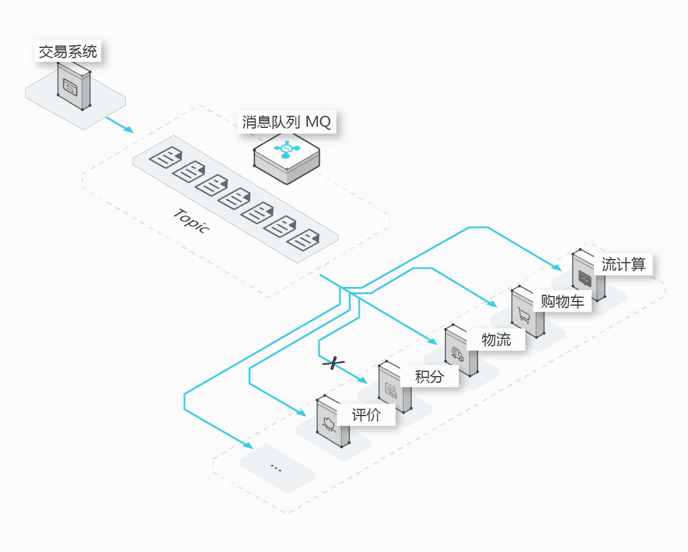
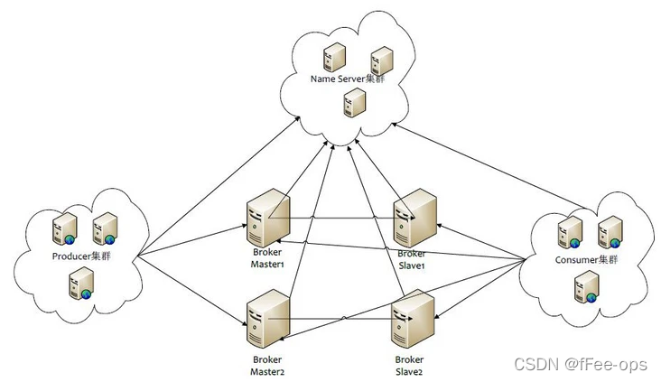

## 分布式系统第2次实验报告

| 姓名   | 学号     |
| ------ | -------- |
| 常程   | 19231149 |
| 李宇轩 | 19231151 |

### 技术方案&原理解析

#### 消息中间件

使用消息队列这一外部中间件来实现系统的功能拆分，实现业务的松耦合。

#### RocketMQ的基本概念

##### NameServer

一个无状态的节点，作为RocketMQ的服务注册中心，向外部暴露唯一的服务地址。

##### Broker

Broker是消息的存储中心，用来接收生产者的消息并存储，消费者从Broker手中消费消息。Broker启动后需要注册到NameServer才能开始服务。

##### 生产者Producer

通过同步发送、异步发送、单向发送等多种方式生产消息。

##### 消费者Consumer

从topic接收并消费消息，从Broker处拉取或者Broker主动向消费者推送。

### 技术实现

程序分为消费者和生产者两部分

##### 生产者部分

##### 消费者部分

### 实验测试

#### 实验

##### 订阅和取消订阅

##### 延迟测试

#### 结果分析

精度：

一致性：

可用性：

### 改进方案

- 
- 
