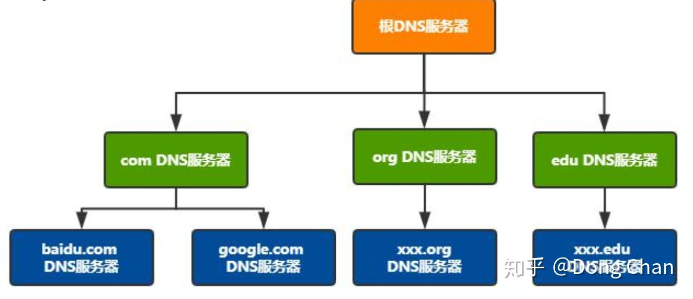
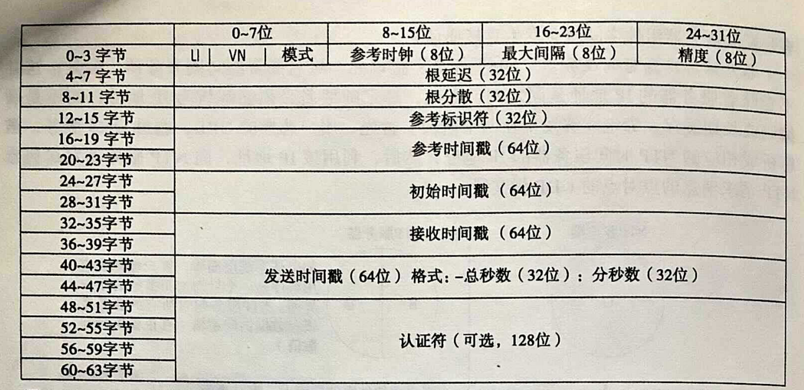
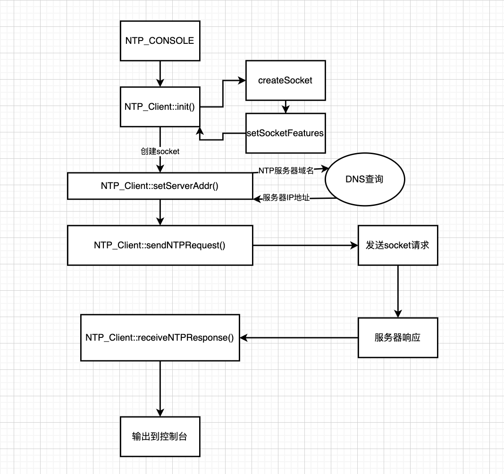
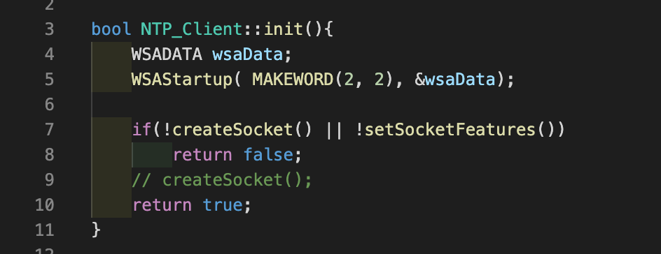
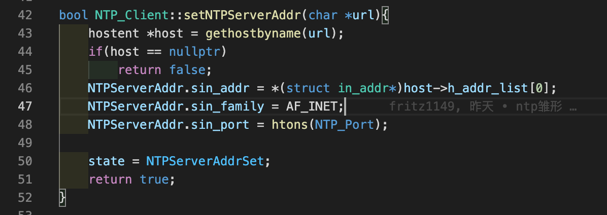
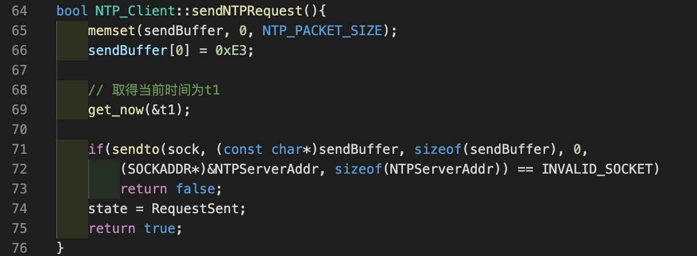
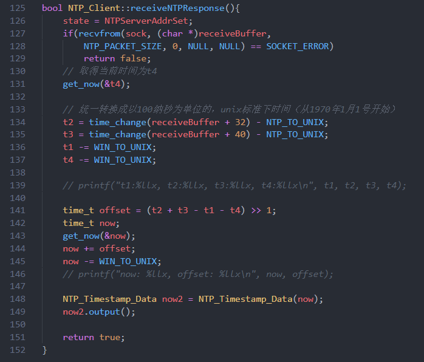
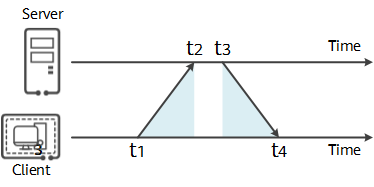

## 分布式系统第1次实验报告

| 姓名   | 学号     |
| ------ | -------- |
| 常程   | 19231149 |
| 李宇轩 | 19231151 |

### 技术方案&原理解析

#### UDP

不管是单机的C/S系统还是分布式的多机系统，都是建立在通过网络通信的基础上的。提到通信就不得不提TCP和UDP这两个经典的传输层协议。

##### 为什么要使用UDP

为什么要使用UDP，就相当于在问为什么不使用TCP。TCP和UDP的主要区别就在于可靠和不可靠，握手和不握手，挥手和不挥手。UDP协议是一种不可靠的、无连接的传输层协议， 该协议只实现了传输层所要求的最低实现， 即进程到进程的数据交付和差错检查。 UDP协议只负责将数据报发送至远程， 不保证数据传输的有序性， 我们粗略的认为UDP协议就是直接和IP协议打交道， 自己并没有做什么额外的工作。当校验失败的时候， UDP协议对差错的恢复根本无能为力， 因为是无连接的协议， 所以不能通知发送方再发送一次， 只能将包丢弃。由于UDP对已损坏的包只能采取丢弃行为， 那么在客户端看来， 就切切实实的丢失了数据。但是由于无连接的特性， 使得UDP协议要比面向连接的TCP协议拥有更快的数据传输。 这里的更快是指UDP协议不需要建立连接， 省去了这个过程。 此外UDP协议还提供广播服务， 可以用于内网的多播服务， 效率要比TCP协议更高。所以在对latency要求较高但不要求所有数据都要正常发送接收的场景就可以使用UDP协议，比如游戏服务器、直播、DNS解析、NTP等。

#### DNS服务

虽然客户端需要知道NTP服务器的ip地址才可以向其发出网络请求，但在客户端代码里硬编码服务器的IP地址是不现实的，会带来更加高昂的维护成本和不必要的版本迭代。为此需要通过DNS服务来将NTP服务器的域名动态地解析为NTP服务器的IP地址。

##### DNS系统结构

##### DNS解析过程

DNS查询分为递归查询和迭代查询两种，迭代查询指本地DNS服务分别向根域名服务器、顶级域名服务器、二级域名服务器等依次发出请求，每次请求依赖前一次请求；递归查询指本地DNS服务向根域名服务器发起请求，根域名服务器向顶级域名服务器发起请求，顶级域名服务器向二级域名服务器发起请求等，最后由根域名服务器交还给本地DNS服务。

#### NTP

##### NTP的用途

用来在分布式时间服务器和客户端之间进行时间同步。NTP基于UDP报文进行传输，使用的UDP端口号为123，是熟知端口。使用NTP的目的是对网络内所有具有时钟的设备进行时钟同步，使网络内所有设备的时钟保持一致，从而使设备能够提供基于统一时间的多种应用。对于运行NTP的本地系统，既可以接收来自其他时钟源的同步，又可以作为时钟源同步其他的时钟，并且可以和其他设备互相同步。

##### NTP的PDU

### 技术实现

系统的流程图如下所示：

首先执行NTP_Client的初始化，函数如下所示：

初始化过程中创建套接字用来与NTP服务器通信，接收来自NTP服务器的响应，此处套接字可以工作在阻塞或非阻塞模式。

教科书中采用的方案是将套接字设置为非阻塞模式以防止由于网络延迟造成的长时间等待，并且在发送NTP请求之后手动 `Sleep` 500毫秒以保证能在非阻塞模式下接收到返回的UDP报文；

我们采用的方案是设置套接字为阻塞模式，并且设置500毫秒的超时时间，这样既不会产生长时间等待，又能及时地获取NTP服务器返回的报文信息，从而能够更精确地计算本地时间与NTP服务器的标准时间的偏移。

NTP_Client初始化完成后执行setServerAddr,函数接受一个字符串参数，表示NTP服务器的域名，并调用windows平台的api gethostbyname(char*)来通过DNS查询获取NTP服务器的ip地址，并设置套接字的目标ip地址和端口为123端口，并设置ip协议族版本号为ipv4。

setServerAddr函数如下所示：

得到NTP服务器ip地址并设置好套接字后开始发送NTP请求，sendNTPRequest函数如下所示：

首先获取当前时间作为t1，然后调用库函数sendto，向NTP服务器发送NTP请求。

发送后立即调用接收返回报文的函数receiveNTPResponse，该函数如下所示：

接到返回报文后，立即调用系统API获取当前时间作为 `t4` ，至此就获得图中的 `t1` `t2` `t3` `t4`。

接下来，首先统一NTP报文中给出的时间以及本地API给出的时间的精度以及起始时间（NTP报文给出的时间是从1900年1月1日开始计算的，WINDOWS的API给出的本地时间是从1601年1月1日开始计算的），接着通过公式 $\text{offset}=(t_2+t_3-t_1-t_4)/2$ 来算出NTP时间较本地时间的偏移。

接着，出于提高当前时间的精度的考虑，重新获取本地当前时间，将其与之前算出的偏移量相加就得到了当前时间的校正后版本，对这个时间加以解析就可以得出UTC的时、分、秒、毫秒、微秒。至此就完成了一次NTP时间校正。

### 改进方案

​	可以考虑使用多个NTP服务器备用，在程序初始化时对每个服务器ping五次，选择其中延迟最低的服务器。或是同时与多个NTP服务器建立连接，但只使用其中一台作为授时，当与这台的连接断开时再采用其他服务器作为授时。
