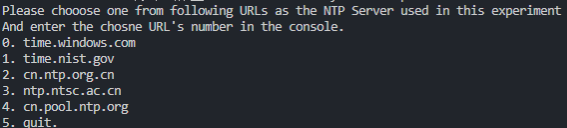
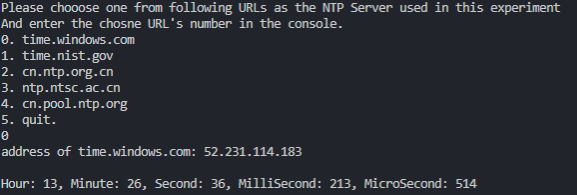
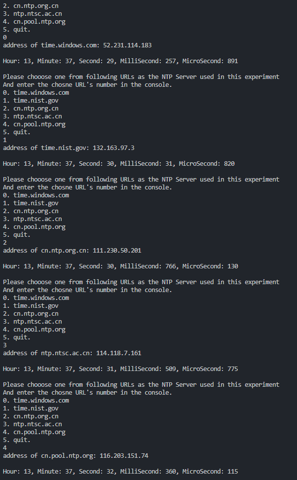
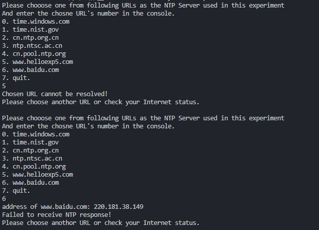
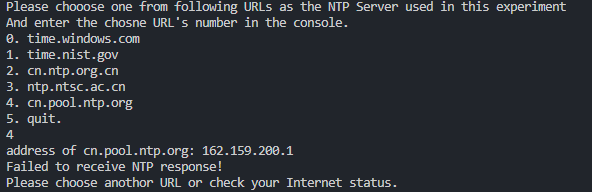

## 分布式系统第1次实验报告

| 姓名   | 学号     |
| ------ | -------- |
| 常程   | 19231149 |
| 李宇轩 | 19231151 |

### 技术方案&原理解析

#### UDP

不管是单机的C/S系统还是分布式的多机系统，都是建立在通过网络通信的基础上的。提到通信就不得不提TCP和UDP这两个经典的传输层协议。

##### 为什么要使用UDP

为什么要使用UDP，就相当于在问为什么不使用TCP。TCP和UDP的主要区别就在于可靠和不可靠，握手和不握手，挥手和不挥手。UDP协议是一种不可靠的、无连接的传输层协议， 该协议只实现了传输层所要求的最低实现， 即进程到进程的数据交付和差错检查。 UDP协议只负责将数据报发送至远程， 不保证数据传输的有序性， 我们粗略的认为UDP协议就是直接和IP协议打交道， 自己并没有做什么额外的工作。当校验失败的时候， UDP协议对差错的恢复根本无能为力， 因为是无连接的协议， 所以不能通知发送方再发送一次， 只能将包丢弃。由于UDP对已损坏的包只能采取丢弃行为， 那么在客户端看来， 就切切实实的丢失了数据。但是由于无连接的特性， 使得UDP协议要比面向连接的TCP协议拥有更快的数据传输。 这里的更快是指UDP协议不需要建立连接， 省去了这个过程。 此外UDP协议还提供广播服务， 可以用于内网的多播服务， 效率要比TCP协议更高。所以在对latency要求较高但不要求所有数据都要正常发送接收的场景就可以使用UDP协议，比如游戏服务器、直播、DNS解析、NTP等。

#### DNS服务

虽然客户端需要知道NTP服务器的ip地址才可以向其发出网络请求，但在客户端代码里硬编码服务器的IP地址是不现实的，会带来更加高昂的维护成本和不必要的版本迭代。为此需要通过DNS服务来将NTP服务器的域名动态地解析为NTP服务器的IP地址。

##### DNS系统结构

##### DNS解析过程

DNS查询分为递归查询和迭代查询两种，迭代查询指本地DNS服务分别向根域名服务器、顶级域名服务器、二级域名服务器等依次发出请求，每次请求依赖前一次请求；递归查询指本地DNS服务向根域名服务器发起请求，根域名服务器向顶级域名服务器发起请求，顶级域名服务器向二级域名服务器发起请求等，最后由根域名服务器交还给本地DNS服务。

##### DNS应用场景

- 客户端请求服务端：客户端访问服务端通过域名访问
- 企业内部DNS：线上服务之间访问通过DNS。服务方变更IP只需改DNS配置即可
- 预留资源实现客户端无感知扩容；提前为节点规划多个域名，未来扩容无感知
- 通过域名二级映射从而多个域名修改时一键完成
- IP负载均衡

#### NTP

##### NTP的用途

用来在分布式时间服务器和客户端之间进行时间同步。NTP基于UDP报文进行传输，使用的UDP端口号为123，是熟知端口。使用NTP的目的是对网络内所有具有时钟的设备进行时钟同步，使网络内所有设备的时钟保持一致，从而使设备能够提供基于统一时间的多种应用。对于运行NTP的本地系统，既可以接收来自其他时钟源的同步，又可以作为时钟源同步其他的时钟，并且可以和其他设备互相同步。

##### NTP的PDU

##### NTP工作原理概要

NTP服务器所维护的时间被视作精确的时间。

客户端向NTP服务器发送请求报文，并记录发送报文的时间 `t1` ；NTP服务器收到请求后，记录接收时间 `t2`，并记录发送回应报文的时间 `t3`；客户端在接收返回报文时，记录时间 `t4`。

NTP协议假设客户端发送请求报文、NTP服务器发送回应报文的延迟相同，则有如下关系：

$t2 = t1 + d +\Delta t$

$t3=t4-d+\Delta t$

从而有：

$\Delta t=(t2+t3-t1-t4)/2$

$d=(t2-t3-t1+t4)/2$

从而就能够校正客户端的本地时间

### 技术实现

系统的流程图如下所示：

首先执行NTP_Client的初始化，函数如下所示：

初始化过程中创建套接字用来与NTP服务器通信，接收来自NTP服务器的响应，此处套接字可以工作在阻塞或非阻塞模式。

教科书中采用的方案是将套接字设置为非阻塞模式以防止由于网络延迟造成的长时间等待，并且在发送NTP请求之后手动 `Sleep` 500毫秒以保证能在非阻塞模式下接收到返回的UDP报文；

我们采用的方案是设置套接字为阻塞模式，并且设置500毫秒的超时时间，这样既不会产生长时间等待，又能及时地获取NTP服务器返回的报文信息，从而能够更精确地计算本地时间与NTP服务器的标准时间的偏移。

NTP_Client初始化完成后执行setServerAddr,函数接受一个字符串参数，表示NTP服务器的域名，并调用windows平台的api gethostbyname(char*)来通过DNS查询获取NTP服务器的ip地址，并设置套接字的目标ip地址和端口为123端口，并设置ip协议族版本号为ipv4。

setServerAddr函数如下所示：

得到NTP服务器ip地址并设置好套接字后开始发送NTP请求，sendNTPRequest函数如下所示：

首先获取当前时间作为t1，然后调用库函数sendto，向NTP服务器发送NTP请求。

发送后立即调用接收返回报文的函数receiveNTPResponse，该函数如下所示：

接到返回报文后，立即调用系统API获取当前时间作为 `t4` ，至此就获得图中的 `t1` `t2` `t3` `t4`。

接下来，首先统一NTP报文中给出的时间以及本地API给出的时间的精度以及起始时间（NTP报文给出的时间是从1900年1月1日开始计算的，WINDOWS的API给出的本地时间是从1601年1月1日开始计算的），接着通过公式 $\text{offset}=(t_2+t_3-t_1-t_4)/2$ 来算出NTP时间较本地时间的偏移。

接着，出于提高当前时间的精度的考虑，重新获取本地当前时间，将其与之前算出的偏移量相加就得到了当前时间的校正后版本，对这个时间加以解析就可以得出UTC的时、分、秒、毫秒、微秒。至此就完成了一次NTP时间校正。

### 实验测试

#### 实验

1. 允许用户基于NIST的域名选择一个NTP服务器。

​		程序UI如图：

​		

​		可以看到，程序给出了文字提示，用户可以在命令行中输入目标NTP服务器的编号以选择该服务器进行实验。

2. 可靠静默地把选定的NIST服务域名解析为相应的IP地址。

​		选择了某个NIST服务器后程序的响应如图：

​		

​		可以看到，程序将解析得到的IP地址输出在命令行中，且没有暴露解析IP的过程。

3. 可靠静默地与合适的NTP服务器实例建立连接；用户应该不会察觉到该行为的细节。

​		一次完整请求的命令行结果如图：

​		

​		可以看到，用户根据提示输入选择的NIST服务器的编号后，在请求过程顺利的情况下，命令行仅会输出目标服务器的IP地址，以及通过NTP协议解析得到的当前时间，连接、请求的具体过程不会暴露。

4. 从NTP时间服务获得NTP时间戳。无论连接哪一个NTP服务器实例，都获得了正确的时间戳。

​		短时间内，依次对本次实现的程序给出的所有NTP服务器进行请求得出的结果如图：

​		

​		可以看到，相邻两次请求，得到的UTC时间相差不超过2秒，且时间是单调递增的，说明能够满足“无论连接哪一个NTP服务器实例，都获得了正确的时间戳”的要求。

5. 静默处理NIST域名不正确的情形。

​		为了进行本次实验，特地改变了程序读取的URL列表，在其中添加了两项错误的URL，这两项URL分别是域名不能解析的、域名能解析但不是NIST服务器域名的，实验结果如图：

​		

​		可以看到，选择不能解析的NIST域名，会直接报错——无法解析域名；

​		选择不是NIST服务器的域名，会在发送请求后得不到响应，因此也会报相应的错误信息。

​		上述两者的过程，不会暴露中间处理的结果，只会报告错误信息提示。

6. 静默处理NTP服务器未响应请求的情形（或者请求消息/响应消息丢失）。

	为了进行本次实验，将程序代码中接收NTP反馈的超时时间调成了5毫秒，从而捕获了一次超时未收到响应信息的情况：

	

	不会暴露中间处理的结果，只会报告错误信息提示。

	根据程序设计，发送NTP请求失败时，也会在命令行输出报错信息。

#### 结果分析

精度：达到微秒级别。

一致性：根据实验4的结果，短时间内依次向多个NTP服务器发送请求，其结果相差很少并且解析的时间严格递增，因此可以认为实现的程序一致性较好。

可用性：程序的可用性与用户的网络情况有关。在国内典型的网络状况下，当以不必翻墙就能建立通讯的服务器通信时，一般都能在500毫秒内得到反馈，可以认为可用性较好。

### 改进方案

​	可以考虑使用多个NTP服务器备用，在程序初始化时对每个服务器ping五次，选择其中延迟最低的服务器。或是同时与多个NTP服务器建立连接，但只使用其中一台作为授时，当与这台的连接断开时再采用其他服务器作为授时。
